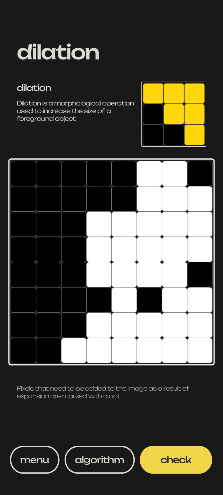

# Pixl - Image Processing Algorithms Educational Trainer

## 📌 About the Project

**Pixl** is an interactive educational puzzle game developed in Unity, designed to teach and demonstrate the core concepts, methods, and algorithms of digital image processing. By combining theoretical knowledge with hands-on, grid-based puzzle mechanics and testing modules, the application serves as a comprehensive trainer for students and enthusiasts alike.

This project was originally developed in **2023** as a diploma work for **BNTU (Belarusian National Technical University)**. The recent updates were focused exclusively on final maintenance, UI polishing, and expanded localization to prepare the repository for its final, archived state. The core legacy logic and architecture from 2023 remain preserved to showcase the project's original technical foundations.

## ✨ Features

The application is structured into three primary educational modules:

1.  **📖 Theory (Wiki)**
    *   Detailed theoretical materials explaining fundamental image processing algorithms.
    *   Topics covered include Image Fundamentals, Binary & Grayscale Images, Binarization, Color Models, Filtering (Erosion, Dilation), Segmentation, Texture Analysis, and Thinning algorithms.

2.  **🧩 Practice (Interactive Grid Puzzles)**
    *   Interactive visualizations where users apply algorithms step-by-step on a 2D grid.
    *   Supported algorithms include:
        *   **Distance Metrics (Smudging):** Euclidean Distance, City Block (Manhattan) Distance, Chessboard (Chebyshev) Distance.
        *   **Morphological Filtering:** Erosion and Dilation.
        *   **Image Thinning:** Zhang-Suen Method.

3.  **📝 Testing**
    *   Comprehensive test modules to assess the user's understanding of the theoretical material.
    *   Features multiple-choice questions, localized text and images, and dynamic result evaluations.

 

## 🌍 Localization

The application features a robust custom localization system supporting three languages:
*   🇬🇧 English
*   🇷🇺 Russian
*   🇪🇸 Spanish

The UI, theoretical content, and over 90+ test questions and answers dynamically adapt to the user's selected language preferences.

## 🛠 Technical Stack

*   **Engine:** Unity (Targeting `6000.5.0a6` Alpha for final polish)
*   **Language:** C#
*   **UI System:** Unity UGUI / TextMeshPro
*   **Data Management:** ScriptableObjects (for Theory, Practice Cards, and Question Data)
*   **Target Platforms:** Desktop / WebGL / Mobile

## 📦 Project Structure & Legacy Context

As a preserved 2023 diploma project, the architecture reflects the conventions of its time. 
*   **`Assets/Scripts/Grid/`**: Core implementation of the puzzle grid and procedural generation (`LevelBase`, `LevelGenerator`).
*   **`Assets/Scripts/Localization/`**: Custom JSON-based dictionary and `LocalizationsIds` manager.
*   **`Assets/ScriptableObjects/`**: Heavily utilizes Unity's ScriptableObjects for isolated, manageable content data.
*   **`Assets/Scripts/UI/` & `MenuUI/`**: Controller logic for navigating between menus, theory pages, and the interactive game scene.

> **Note on Updates:** The latest commits to this repository were strictly limited to surgical UI alignment fixes, data serialization corrections, and comprehensive localization expansion. No major refactoring was performed, preserving the authenticity of the original 2023 codebase.

## 📜 Archival Status

This project is considered **Feature Complete** and is currently **Archived**. It stands as a functional educational tool and a portfolio piece demonstrating proficiency in Unity UI, ScriptableObject architecture, and algorithm visualization.

---
*Developed for the discipline "Methods and algorithms of image processing" at BNTU.*